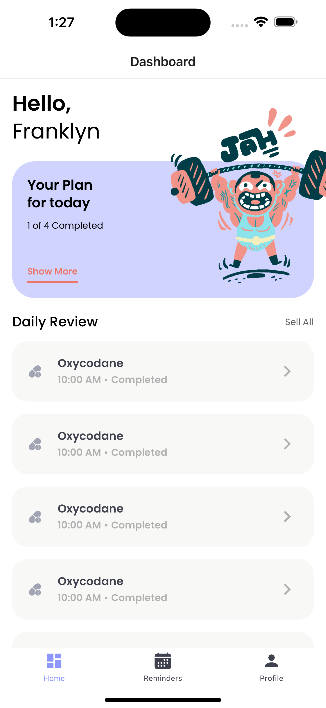
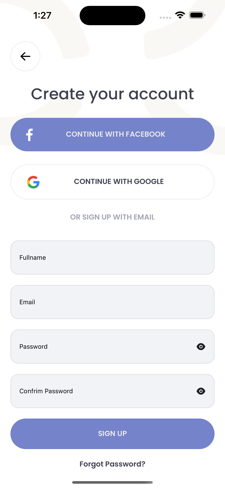
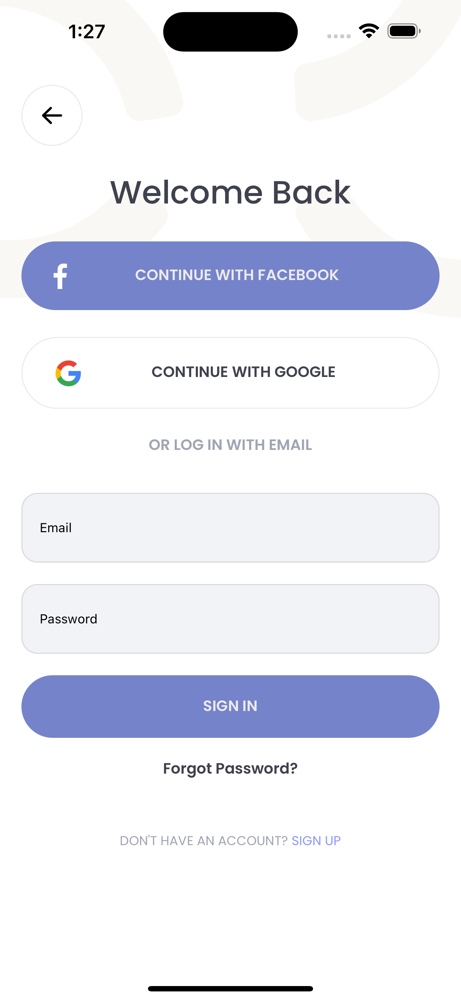
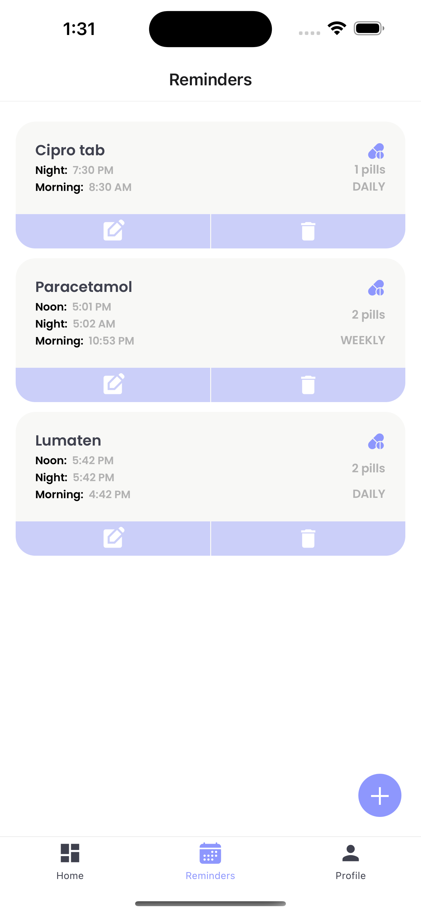
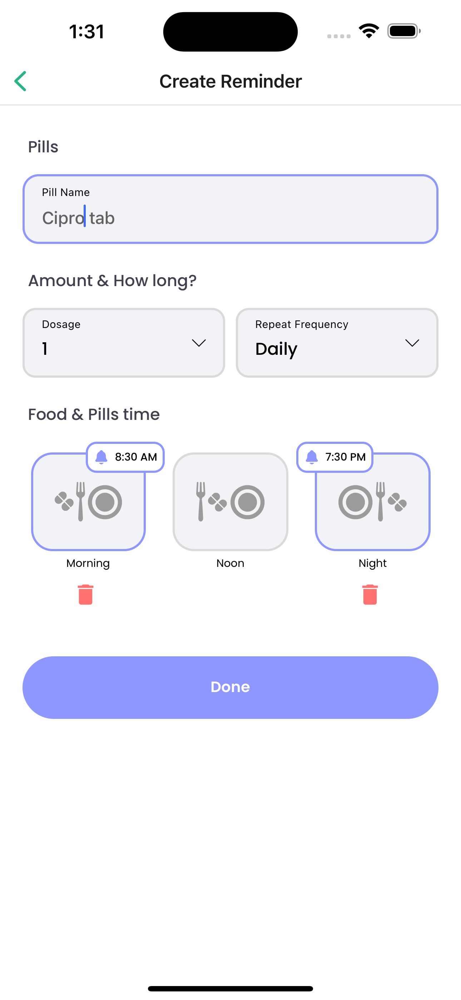
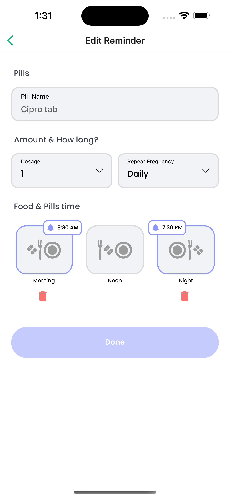
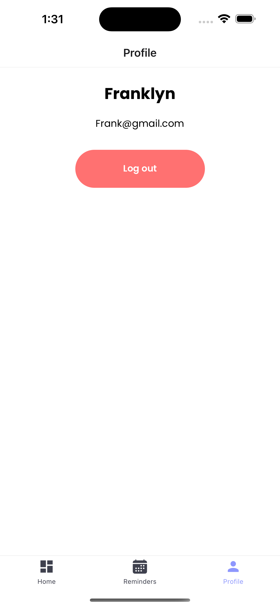

# # MedMindApp - Pill Reminder Mobile Application



### MedMindApp is a mobile application built using React Native that serves as a pill reminder to help patients remember to take their pills on time. The app follows the MVC (Model-View-Controller) code pattern to ensure a well-organized and maintainable codebase.

## Features

- Authentication: Allow users to sign up and log in to the app.

- Pill Reminder: Set up pill reminders with customizable schedules which allows add, edit, and delete medication reminders. reminder have a name, dosage, repeat frequency, and time of day for the user to take the medication, to ensure timely medication.

- User-Friendly Interface: An intuitive and user-friendly interface that makes it easy to manage and track pill reminders.

- Notifications: Receive notifications and reminders to take pills based on the schedule set.

- Dashboard: to display all upcoming medication reminders

- MVC Architecture: The app is structured following the MVC (Model-View-Controller) pattern, promoting separation of concerns and maintainability.

## Tech Used

- React Native
- Redux
- Notifee (a local notifications library and does not integrate with any 3rd party messaging services.)

## How to build

Default branch:

```
$ master
```

Clone this repo to your machine:

```
$ git clone https://github.com/frankelly001/medmindpal.git
```

```
$ cd medmindapp
```

Install dependencies:

```
$ yarn install
```

If you are running app on iOS:

```
$ cd ios
```

```
$ pod install
```

Return to the project main directory:

```
$ cd ..
```

To run on android:

```
$ react-native run-android
```

To run on iOS:

```
$ react-native run-ios
```

## Usage

- Launch the MedMindApp on your mobile device or emulator.

- Create a new pill reminder by providing the necessary details, including pill name, dosage, and reminder schedule.

- The app will send notifications at the scheduled times to remind you to take your pills.

- Mark the pill as taken within the app once you've taken it (not yet available).

<p float="left">









</p>

<br />

Built by @Frankelly
